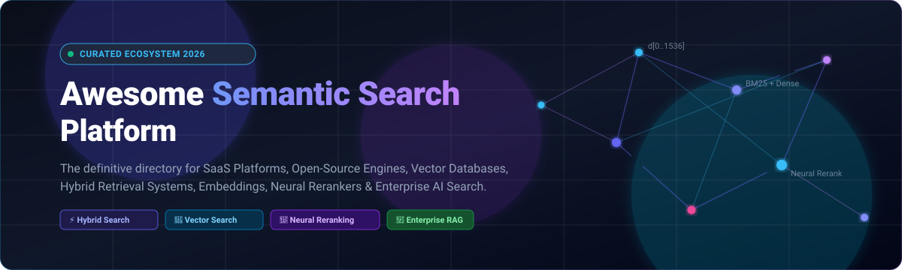
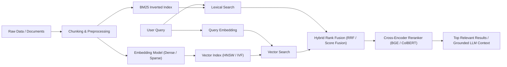

# 🔍 Awesome Semantic Search Platform ⚡

  
  
  
  
  
  

  <strong>Curated ecosystem of SaaS &amp; Open-Source Semantic Search Engines, Vector Databases, Neural Retrieval, Hybrid Search, and Enterprise AI Search Platforms.</strong>

---

## 🌟 Overview &amp; Ecosystem

Welcome to the **Awesome Semantic Search Platform** guide! This repository tracks premier **SaaS/Hosted Platforms**, **Open-Source Search Engines**, **Vector Databases**, **Neural Retrieval Frameworks**, and **RAG Search Pipelines**. 

Unlike legacy search engines that match literal keywords, modern **semantic search systems** evaluate meaning, intent, context, semantics, and relationships. They combine **BM25 lexical search + dense/sparse vector retrieval + neural reranking + learned sparse representations (SPLADE/BGE-M3) + late interaction (ColBERT) + knowledge graphs + LLM query understanding**.

---

## 📑 Table of Contents

- [🏢 SaaS &amp; Hosted Platforms](#-saas--hosted-platforms)
- [💻 Open-Source GitHub Projects](#-open-source-github-projects)
- [🧩 Recommended Open-Source Stacks](#-recommended-open-source-stacks)
- [🧱 Semantic Search Building Blocks](#-semantic-search-building-blocks)
- [🔬 Core Search &amp; Retrieval Concepts](#-core-search--retrieval-concepts)
- [🤝 How to Contribute](#-how-to-contribute)
- [📈 Star History](#-star-history)
- [⚖️ Disclaimer](#️-disclaimer)

---

## 🏢 SaaS &amp; Hosted Platforms

The table below is sorted in **descending order by company size** (market capitalization / valuation &amp; annual revenue) and includes transparent starting-tier pricing and specific free tier / free trial limits.

| Platform / Product | Valuation / Revenue (Company Size) | Description | Pricing (Starting Tier) | Free Tier / Trial Limits |
| :--- | :--- | :--- | :--- | :--- |
| **[Azure AI Search](https://azure.microsoft.com/products/ai-services/ai-search)** | **~$3.1 Trillion** Market Cap / $245B+ Annual Revenue (Microsoft) | Cloud enterprise search service providing keyword, dense/sparse vector search, hybrid retrieval, and AI semantic reranking. | **Basic Tier:** Starts at ~$73.73/month (~$0.101/hour per Search Unit: 1 replica × 1 partition, 2 GB storage, up to 15 indexes); **Standard S1:** ~$245/month | **Free Tier (Free Forever):** 50 MB storage, up to 3 indexes, 1 free search service per Azure subscription (shared infrastructure, semantic ranker excluded) |
| **[Elasticsearch (Elastic Cloud)](https://www.elastic.co/elasticsearch)** | **~$10.5 Billion** Market Cap / $1.4B Annual Revenue (Elastic - NYSE: ESTC) | Distributed search and analytics engine supporting full-text BM25, dense/sparse vector search, hybrid retrieval, and AI search applications. | **Standard Tier:** Starts at ~$95 – $99/month (~$0.133/hour for entry-level 120 GB storage across 2 AZs); scales with provisioned RAM, vCPU, and storage | **14-Day Free Trial:** 1 hosted deployment (up to 8 GB RAM across 2 AZs), 3 Serverless projects, no credit card required (extendable by 7 days) |
| **[Elastic AI Search](https://www.elastic.co/enterprise-search)** | **~$10.5 Billion** Market Cap / $1.4B Annual Revenue (Elastic - NYSE: ESTC) | Elastic's AI-native search suite featuring built-in ELSER semantic models, vector search, hybrid retrieval, and RAG connector workflows. | **Standard Tier:** ~$99/month; **Platinum Tier** (includes proprietary ELSER semantic models and ML inference): Starts at ~$125/month (~$0.175/hr) | **14-Day Free Trial:** Full access to vector search, semantic ELSER model deployment, 1 deployment up to 8 GB RAM, 3 Serverless projects |
| **[Glean](https://www.glean.com/)** | **~$4.6 Billion** Valuation (Series E) / $100M+ ARR | Enterprise AI search and workplace knowledge copilot connecting SaaS apps with semantic understanding and permissions. | **Enterprise Tier:** Starts at ~$50 – $75 per user/month with standard 100-seat minimum commitment (~$50,000 – $60,000/year ACV) + optional $15/user/mo AI add-on | **Guided POC (14 to 30 Days):** No self-serve free tier; provides a guided 14–30 day enterprise sandbox evaluation with connected data sources upon qualification |
| **[Algolia](https://www.algolia.com/)** | **~$2.25 Billion** Valuation (Series D) / $200M+ ARR | API-first search and discovery platform providing typo tolerance, autocomplete, faceted navigation, personalization, and AI ranking. | **Grow Plan:** $0.50 per 1,000 search requests (includes 100k records; additional records at $0.40/1k records/mo); **Grow Plus:** $1.75 per 1,000 requests | **Free Forever ("Build" Plan):** 10,000 search requests/month, 50,000 records, 5,000 recommendation requests/month, 1 GB data limit, max 10 KB per record |
| **[Algolia NeuralSearch](https://www.algolia.com/products/features/neuralsearch)** | **~$2.25 Billion** Valuation (Series D) / $200M+ ARR | Hybrid semantic search engine combining keyword matching with vector retrieval, neural ranking, and query understanding. | **Elevate / Premium Tier:** Custom annual enterprise contracts starting at ~$50,000/year (includes NeuralSearch indexing & query pipeline) | **Free Forever ("Build" Plan):** 10,000 search requests/month (keyword/hybrid sandbox); 14-day dedicated AI Search trial upon request |
| **[Coveo](https://www.coveo.com/)** | **~$900 Million** Market Cap / $130M Annual Revenue (TSX: CVO) | Enterprise AI search and relevance platform delivering semantic understanding, personalization, and generative answering. | **Base / Pro Tier:** Annual contracts starting at ~$2,500/month (~$30,000/year) based on 100,000 queries/month entitlement | **14-Day Free Trial:** Full prototype organization access with standard connectors and ML models; no credit card required (30-day POC for qualified enterprises) |
| **[Yext Search](https://www.yext.com/)** | **~$850 Million** Market Cap / $400M Annual Revenue (NYSE: YEXT) | AI search engine leveraging knowledge graphs to deliver direct answers and conversational discovery across digital touchpoints. | **Essential Tier:** Starts at ~$199 per location/year (~$16.50/month); Enterprise search deployments start at ~$1,500 – $2,000/month | **14-Day Interactive Sandbox/Trial:** Available via sales-assisted demo request with sample Knowledge Graph configurations and search UI testing |
| **[Constructor.io](https://constructor.com/)** | **~$550 Million** Valuation (Series B) / $40M+ ARR | AI-first product discovery and e-commerce search platform optimizing results and browse ranking for revenue and conversions. | **Enterprise Tier:** Starts at ~$2,000 – $3,500/month (~$24,000 – $42,000/year) based on product catalog SKU size and monthly search/browse query volume | **2-to-4-Week "Proof Schedule" Trial:** Risk-free assessment using real catalog data and user traffic to benchmark conversion lift and relevance before contract |
| **[Lucidworks Fusion / Springboard](https://lucidworks.com/)** | **~$370 Million** Valuation / $100M+ ARR | Enterprise search and AI platform combining Apache Solr, neural hybrid search, ML relevance tuning, and generative answers. | **Enterprise Contracts:** Starts at ~$2,500 – $3,500/month (~$30,000 – $42,000/year) based on indexed document volume and search traffic | **14-to-30-Day Guided POC:** Custom enterprise proof-of-concept environment with Solr and neural search pipeline sandbox upon sales engagement |
| **[Vespa Cloud](https://vespa.ai/)** | **~$175 Million** Valuation / $31M+ Raised | Managed real-time big data search and recommendation engine combining lexical search, vector search, ColBERT, and tensor evaluations. | **Resource-Based Rates:** $0.18/vCPU-hour + $0.018/GB RAM-hour + $0.0007/GB disk-hour (typical entry-level cluster starts at ~$30 – $50/month with autoscaling) | **Free Trial with $300 Credits:** $300 in free cloud usage credits, no credit card required (stops automatically when credits expire; Core engine is Apache 2.0 open-source) |
| **[Meilisearch Cloud](https://www.meilisearch.com/)** | **~$90 Million** Valuation / $20M+ Raised | Fully managed, developer-friendly search engine with typo tolerance, instant search-as-you-type, and hybrid/vector capabilities. | **Build Plan:** Starts at $30/month (usage/resource-based); **Pro Plan:** Starts at $300/month for production scaling | **14-Day Free Trial:** Full platform access with no credit card required; engine limits allow up to ~4.3B docs/index and 20 MB web upload limit (Open-source is free forever self-hosted) |
| **[Marqo Cloud](https://marqo.ai/)** | **~$70 Million** Valuation / $17M+ Raised | AI-native vector and multimodal search engine providing end-to-end embedding generation, tensor search, and hybrid ranking. | **Starter Tier:** Starts at ~$0.15/hour (~$108/month) for a dedicated single-replica vector search instance | **Free Evaluation / Sandbox:** $50 free cloud credits or 30-day evaluation with up to 100,000 embeddings (Open-source engine is free forever under Apache 2.0) |
| **[Typesense Cloud](https://typesense.org/)** | **~$50 Million** Valuation / Bootstrapped &amp; Profitable | Managed instant search engine optimized for fast typo tolerance, vector search, conversational search, and hybrid retrieval. | **Dedicated Nodes:** Starts at ~$7.00 – $7.20/month (~$0.01/hour for 0.5 GB RAM / 1 vCPU entry node); scales with RAM, vCPU, and storage | **30-Day / 720-Hour Free Trial:** Includes 720 hours of cluster runtime and 10 GB outbound bandwidth (one-time allowance; Open-source version is free forever self-hosted) |

---

## 💻 Open-Source GitHub Projects

The following curated open-source repositories are **sorted in descending order by GitHub star count**. Each repository includes a real-time star badge linking directly to its stargazers page.

1. **[Elasticsearch](https://github.com/elastic/elasticsearch)**   
   Distributed, RESTful search and analytics engine supporting full-text BM25, k-NN dense vector search, sparse vector retrieval, and hybrid search pipelines.

2. **[Meilisearch](https://github.com/meilisearch/meilisearch)**   
   Ultra-fast, typo-tolerant open-source search engine built in Rust, featuring instant search-as-you-type, filtering, and semantic/hybrid search capabilities.

3. **[LlamaIndex](https://github.com/run-llama/llama_index)**   
   Leading data framework for LLM-based Retrieval-Augmented Generation (RAG), semantic document retrieval, query parsing, and knowledge agent workflows.

4. **[Milvus](https://github.com/milvus-io/milvus)**   
   Cloud-native vector database built for massive-scale similarity search, supporting billions of high-dimensional dense and sparse vector embeddings.

5. **[FAISS](https://github.com/facebookresearch/faiss)**   
   Facebook AI Research's fundamental C++ and Python library for efficient similarity search, clustering, IVF/PQ quantization, and GPU-accelerated nearest neighbor search.

6. **[Qdrant](https://github.com/qdrant/qdrant)**   
   Vector similarity search engine and database written in Rust, offering rich payload-based filtering, multivector search, sparse vectors, and reciprocal rank fusion.

7. **[Chroma](https://github.com/chroma-core/chroma)**   
   AI-native open-source embedding database designed for developer simplicity, fast local prototyping, and scalable semantic retrieval pipelines.

8. **[Typesense](https://github.com/typesense/typesense)**   
   Fast, typo-tolerant search engine written in C++, positioning itself as an open-source Algolia alternative with built-in vector search, conversational search, and hybrid retrieval.

9. **[Haystack](https://github.com/deepset-ai/haystack)**   
   End-to-end framework by deepset for orchestrating neural search pipelines, hybrid retrieval, agentic search, and multi-stage RAG systems.

10. **[pgvector](https://github.com/pgvector/pgvector)**   
    Open-source vector similarity search extension for PostgreSQL, supporting HNSW and IVFFlat indexes with L2 distance, cosine distance, and inner product.

11. **[Sentence Transformers](https://github.com/UKPLab/sentence-transformers)**   
    Python framework for state-of-the-art sentence, text, and image embeddings, bi-encoder similarity calculations, and cross-encoder neural rerankers.

12. **[ZincSearch](https://github.com/zinclabs/zincsearch)**   
    Lightweight, modern alternative to Elasticsearch for full-text indexing, log searching, and structured querying written in Go with minimal resource footprint.

13. **[Weaviate](https://github.com/weaviate/weaviate)**   
    Open-source, cloud-native vector database offering native hybrid search (BM25 + vector), multi-modal indexing, GraphQL APIs, and custom ML module integrations.

14. **[Tantivy](https://github.com/quickwit-oss/tantivy)**   
    Full-text search engine library written in Rust, strongly inspired by Apache Lucene and built for extreme indexing and query throughput.

15. **[OpenSearch](https://github.com/opensearch-project/OpenSearch)**   
    Community-driven search and analytics suite offering a scalable k-NN vector engine, neural plugins, hybrid score combination, and enterprise security.

16. **[FlagEmbedding (BGE)](https://github.com/FlagOpen/FlagEmbedding)**   
    State-of-the-art dense retrieval foundation models, multi-stage rerankers (BGE Reranker), and multi-function sparse representations (BGE-M3).

17. **[LanceDB](https://github.com/lancedb/lancedb)**   
    Serverless, developer-friendly vector database powered by the Lance columnar data format for multi-modal semantic search, low memory usage, and zero-copy retrieval.

18. **[Vespa Engine](https://github.com/vespa-engine/vespa)**   
    High-scale big data serving engine for vector search, lexical retrieval, machine learning ranking, tensor computations, and ColBERT late interaction.

19. **[Infinity](https://github.com/infiniflow/infinity)**   
    AI-native database designed for LLM applications, delivering ultra-fast hybrid retrieval combining dense vector, sparse vector, and full-text search.

20. **[ColBERT](https://github.com/stanford-futuredata/ColBERT)**   
    Stanford's fast and accurate retrieval model based on late interaction over contextualized token embeddings with PLAID index acceleration.

21. **[Apache Lucene](https://github.com/apache/lucene)**   
    The foundational, high-performance open-source search library and inverted index architecture powering Elasticsearch, Apache Solr, and OpenSearch.

22. **[Apache Solr](https://github.com/apache/solr)**   
    Enterprise search platform built on Apache Lucene, providing distributed indexing, replication, faceted search, learning-to-rank, and neural query extensions.

23. **[Vald](https://github.com/vdaas/vald)**   
    Highly scalable, distributed, cloud-native vector search engine built on top of NGT (Neighborhood Graph and Tree) algorithms.

---

## 🧩 Recommended Open-Source Stacks

### 1. 🔄 Traditional + Semantic Hybrid Search
`OpenSearch + Sentence Transformers + BGE Reranker`  
- **Best for:** Enterprise search combining lexical BM25 precision with dense semantic retrieval and cross-encoder neural reranking.

### 2. ⚡ Developer-Friendly Instant Search
`Typesense + FastEmbed`  
- **Best for:** Applications requiring instant autocomplete, typo tolerance, faceted filtering, and simple operational deployment.

### 3. 🚀 High-Scale Real-Time Semantic Search
`Vespa + Sentence Transformers + ColBERT`  
- **Best for:** Workloads requiring real-time document updates, tensor evaluations, multi-stage machine learning ranking, and late-interaction token retrieval.

### 4. 🧠 Vector-First AI &amp; Recommendation Engine
`Qdrant + FastEmbed + BGE Reranker`  
- **Best for:** Multimodal semantic retrieval, similarity search, multivector payloads, and reciprocal rank fusion.

### 5. 📚 Enterprise Knowledge Retrieval &amp; Document Indexing
`OpenSearch + Apache Tika + Sentence Transformers + Reranker`  
- **Best for:** Ingesting diverse enterprise documents (PDFs, docs, emails, tickets) with rich metadata filtering.

### 6. 🤖 Grounded RAG Search Pipeline
`Qdrant + Sentence Transformers + BGE Reranker + LlamaIndex / Haystack`  
- **Best for:** Document retrieval, semantic passage chunking, and grounding LLM-generated responses with source citations.

---

## 🧱 Semantic Search Building Blocks

### 🔍 Search Types &amp; Paradigms
- **Semantic Search:** Understanding query intent and context rather than literal matching.
- **Lexical / Full-Text Search:** Exact keyword and token matching via BM25 / TF-IDF inverted indices.
- **Vector Search:** Dense vector similarity search in continuous latent embedding spaces.
- **Hybrid Search:** Fusion of lexical and semantic vector retrieval for optimal precision and recall.
- **Neural Search:** End-to-end deep learning models for representation and retrieval.
- **Conversational &amp; Agentic Search:** Multi-turn query rewriting, routing, and tool-augmented agent retrieval.
- **Multimodal Search:** Cross-modal search across text, images, audio, and video via CLIP/VLM embeddings.

### 📐 Indexing &amp; ANN Algorithms
- **HNSW (Hierarchical Navigable Small World):** State-of-the-art graph-based approximate nearest neighbor search.
- **IVF (Inverted File Index):** Fast partition-based clustering for vector indexing.
- **PQ (Product Quantization):** Lossy vector compression for large-scale memory reduction.
- **DiskANN:** Graph-based ANN indexing designed to operate directly on SSD storage.
- **Inverted Index:** Token-to-document posting lists optimized for term frequency and filtering.

### 🎯 Ranking &amp; Fusion Techniques
- **Reciprocal Rank Fusion (RRF):** Combining ranked lists from heterogeneous retrieval systems without score normalization.
- **Cross-Encoder Reranking:** Deep transformer scoring of (query, document) pairs for superior precision.
- **ColBERT Late Interaction:** Token-level similarity matrices evaluated with MaxSim for fine-grained semantic matching.
- **Learning-to-Rank (LTR) / LambdaMART:** Machine-learned ranking using behavioral signals and click-through data.

---

## 🔬 Core Search &amp; Retrieval Concepts

- **Embeddings &amp; Encoders:** Bi-Encoders, Dual Encoders, Sentence Transformers, Matryoshka Embeddings, Contrastive Learning.
- **Similarity Metrics:** Cosine Similarity, Dot Product (Inner Product), Euclidean Distance ($L_2$).
- **Query Understanding:** Query Expansion, Query Rewriting, Intent Classification, Spell Correction, Named Entity Recognition (NER), Facet Extraction.
- **Evaluation Metrics:** NDCG@K, MRR (Mean Reciprocal Rank), Precision@K, Recall@K, MAP (Mean Average Precision), Hit Rate, Latency ($p95/p99$), Throughput (QPS).

---

## 🤝 How to Contribute

Contributions are welcome! Please follow these guidelines:

1. 🍴 **Fork the repository** on GitHub.
2. 📝 **Add or update entries** following the established table and list formatting.
3. 🔎 **Provide accurate information:** Include official links, factual descriptions, specific starting tier pricing, and explicit free tier / free trial limits.
4. ⭐ **Verify open-source licenses** and active maintenance status before proposing new repositories.
5. 🚀 **Submit a Pull Request** with a concise description of your additions!

---

## 📈 Star History

---

## ⚖️ Disclaimer

*This list is community-curated for informational and educational purposes. Commercial SaaS features, pricing, and free tier allowances may change over time; please verify current specifications directly with the respective vendors. Open-source repositories and licensing models should be reviewed before production deployment.*

---

  Maintained with ❤️ by the open-source search and AI community.

